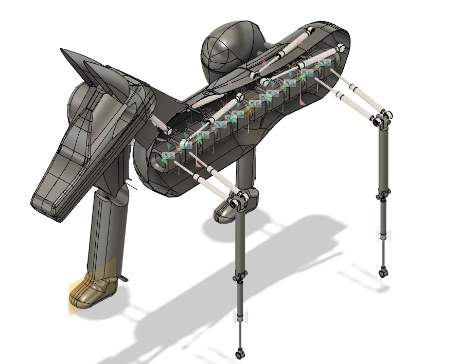
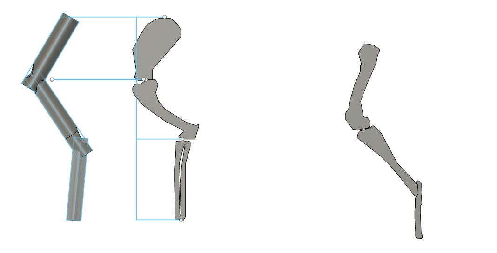
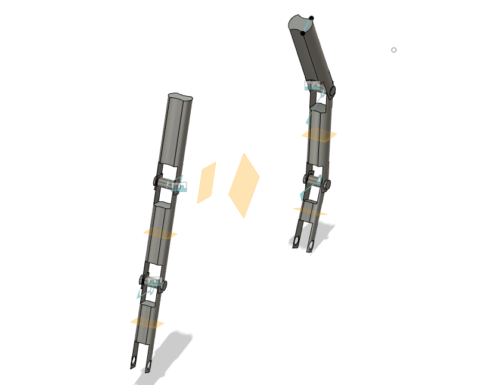
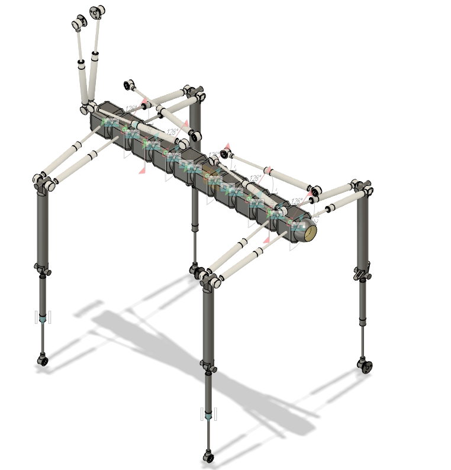
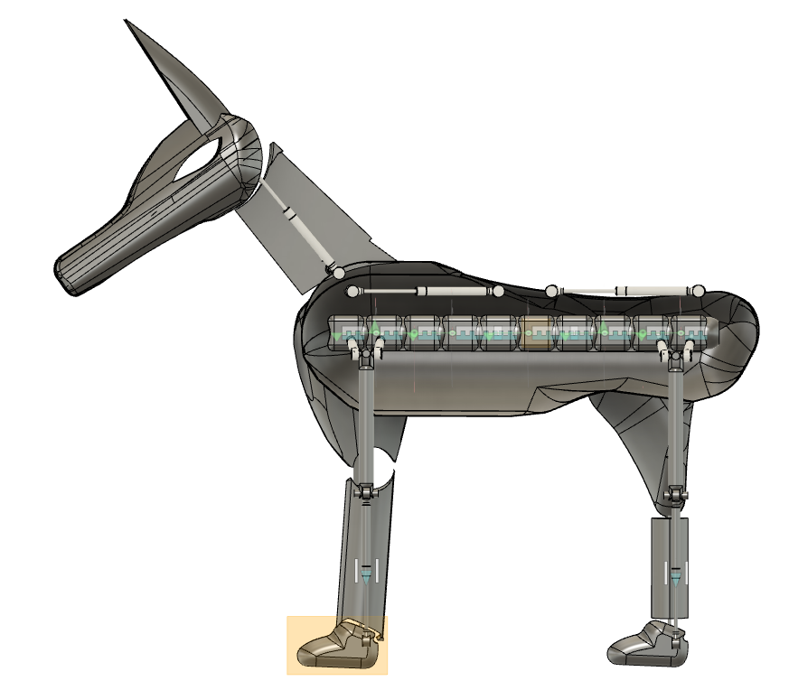
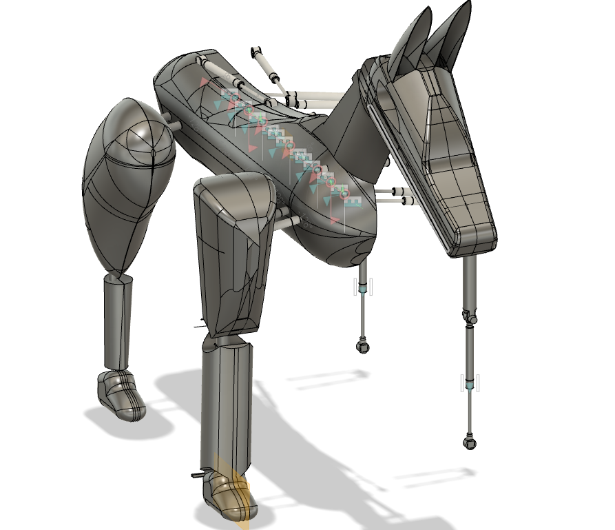

# Anubis, Robot Dog Concept with Artificial Muscles

Ioanna Texakalidou, personal project, 2023

Anubis is a four-legged robot dog I designed in Fusion 360 in 2023. Instead of putting a motor at every joint, I wanted the legs to move the way an animal's do, with artificial muscles pulling on the bones. This project is where my interest in legged robots started, and it later led to my diploma thesis on a walking robot leg.

## What I designed

I modelled the leg bones on a real dog skeleton and routed tubes along them for pneumatic artificial muscles, which work in antagonistic pairs like biceps and triceps. Then I built the frame, the body shell and the head around the four legs.

| Leg bones and muscle tubes | Leg modules |
|---|---|
|  |  |

| Frame | Side view | Front view |
|---|---|---|
|  |  |  |

For the control side I studied open-source pneumatic drive systems for soft robots and wrote a first on/off valve test in Python with gpiozero.

## Status

This is a concept design. It was not built.

## Tools

Fusion 360, Python

Contact: j.texakalidou@gmail.com | [Portfolio](https://ioannatexakalidou.github.io)
